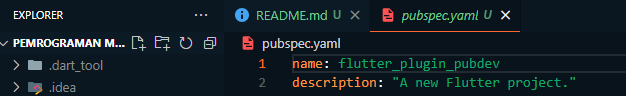
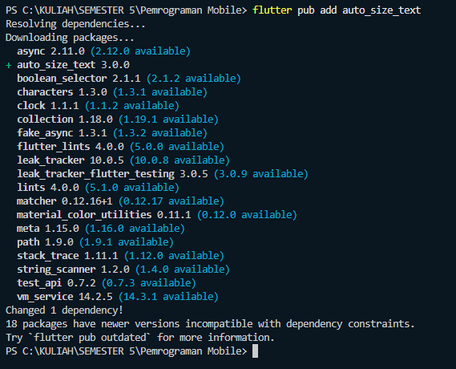
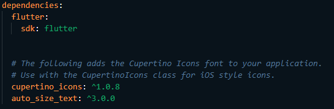
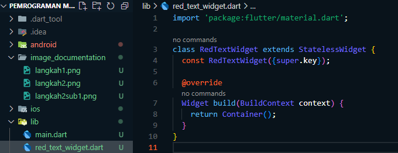
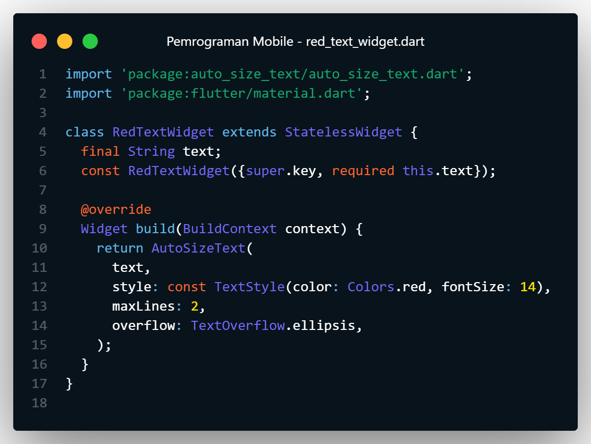
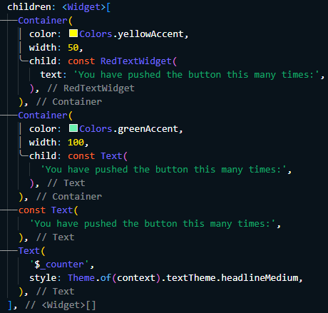
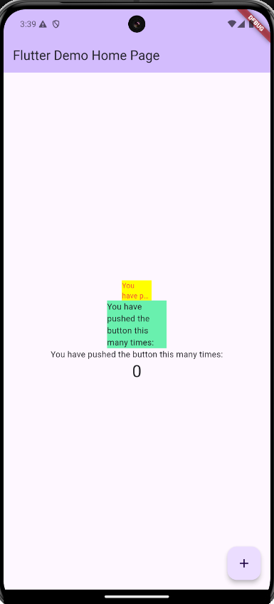

### Nama : Muhammad Nurul Mustofa

### Kelas : TI 3A

### Nim : 2241720022

# 7. Praktikum Menerapkan Plugin di Project Flutter

Selesaikan langkah-langkah praktikum berikut ini menggunakan editor Visual Studio Code (VS Code) atau Android Studio atau code editor lain kesukaan Anda.

`Perhatian: Diasumsikan Anda telah berhasil melakukan setup environment Flutter SDK, VS Code, Flutter Plugin, dan Android SDK pada pertemuan pertama.`

## Langkah 1: Buat Project Baru

Buatlah sebuah project flutter baru dengan nama `flutter_plugin_pubdev`. Lalu jadikan repository di GitHub Anda dengan nama `flutter_plugin_pubdev`.



## Langkah 2: Menambahkan Plugin

Tambahkan plugin `auto_size_text` menggunakan perintah berikut di terminal

`flutter pub add auto_size_text`

Jika berhasil, maka akan tampil nama plugin beserta versinya di file pubspec.yaml pada bagian dependencies.

    


## Langkah 3: Buat file red_text_widget.dart

Buat file baru bernama `red_text_widget.dart` di dalam folder lib lalu isi kode seperti berikut.

```dart
import 'package:flutter/material.dart';

class RedTextWidget extends StatelessWidget {
  const RedTextWidget({Key? key}) : super(key: key);

  @override
  Widget build(BuildContext context) {
    return Container();
  }
}
```



## Langkah 4: Tambah Widget AutoSizeText

Masih di file `red_text_widget.dart`, untuk menggunakan plugin `auto_size_text`, ubahlah kode return `Container()` menjadi seperti berikut.

```dart
return AutoSizeText(
      text,
      style: const TextStyle(color: Colors.red, fontSize: 14),
      maxLines: 2,
      overflow: TextOverflow.ellipsis,
);
```

Setelah Anda menambahkan kode di atas, Anda akan mendapatkan info error. Mengapa demikian? Jelaskan dalam laporan praktikum Anda!

jawaban :
Error muncul setelah menambahkan AutoSizeText karena package auto_size_text belum diimpor. Flutter tidak otomatis mengenali bahwa plugin ini digunakan dalam project, sehingga perlu menambahkan import di bagian atas file red_text_widget.dart dengan perintah berikut: import `'package:auto_size_text/auto_size_text.dart'`;.

## Langkah 5: Buat Variabel text dan parameter di constructor

Tambahkan variabel text dan parameter di constructor seperti berikut.

```dart
final String text;

const RedTextWidget({Key? key, required this.text}) : super(key: key);
```



## Langkah 6: Tambahkan widget di main.dart

Buka file main.dart lalu tambahkan di dalam children: pada class \_MyHomePageState

```dart
Container(
   color: Colors.yellowAccent,
   width: 50,
   child: const RedTextWidget(
             text: 'You have pushed the button this many times:',
          ),
),
Container(
    color: Colors.greenAccent,
    width: 100,
    child: const Text(
           'You have pushed the button this many times:',
          ),
),
```



Run aplikasi tersebut dengan tekan F5, maka hasilnya akan seperti berikut.



## Tugas Praktikum

1. **Selesaikan praktikum ini, dokumentasikan hasilnya, dan unggah ke repository GitHub saya dalam bentuk screenshot pekerjaan beserta penjelasannya pada file README.md.**

2. **Jelaskan maksud dari langkah 2 pada praktikum ini!**

   **Jawab:**

   Pada langkah ini, saya diminta untuk menambahkan plugin `auto_size_text` dengan perintah `flutter pub add auto_size_text`. Langkah ini dilakukan untuk menambah dependency pada proyek Flutter saya. Saat perintah ini dijalankan, Flutter akan secara otomatis menambahkan plugin ke dalam file `pubspec.yaml` pada bagian dependencies, sehingga plugin tersebut dapat digunakan dalam proyek. Plugin **auto_size_text** digunakan untuk menyesuaikan ukuran teks secara otomatis sesuai dengan ruang yang tersedia.

3. **Jelaskan maksud dari langkah 5 pada praktikum ini!**

   **Jawab:**

   Variabel `final String text` berfungsi untuk mendefinisikan bahwa widget `RedTextWidget` akan menerima input berupa teks (String). Dengan menambahkan variabel `text` dan parameter pada constructor, widget `RedTextWidget` sekarang dapat menampilkan teks yang sesuai dengan kebutuhan. Hal ini membuat widget menjadi lebih fleksibel dan dapat digunakan kembali dalam berbagai konteks tanpa perlu mendefinisikan ulang untuk setiap teks yang berbeda.

4. **Pada langkah 6 terdapat dua widget yang ditambahkan, jelaskan fungsi dan perbedaannya!**

   **Jawab:**

   Pada langkah ini, saya menambahkan dua widget `Container`, masing-masing berisi `RedTextWidget` dan `Text`.

   - `RedTextWidget`: Widget kustom yang saya buat menggunakan `AutoSizeText` untuk menampilkan teks dengan ukuran yang otomatis menyesuaikan sesuai ruang yang tersedia. Jika teks terlalu panjang, ukurannya akan berkurang atau dipotong dengan ellipsis (...) jika ruang terbatas.

   - `Text`: Widget standar Flutter yang digunakan untuk menampilkan teks statis. Teks akan ditampilkan dengan ukuran tetap, tanpa adanya penyesuaian otomatis.

   Perbedaan antara keduanya adalah:

   - `RedTextWidget` menggunakan `AutoSizeText`, yang memungkinkan teks beradaptasi dengan ruang yang ada.
   - `Text` adalah widget dasar tanpa fitur penyesuaian otomatis. Teks yang melebihi ruang tidak akan menyesuaikan ukuran, kecuali diatur secara manual.

5. **Jelaskan maksud dari tiap parameter yang ada di dalam plugin auto_size_text berdasarkan tautan pada dokumentasi ini!**

   **Jawab:**

   Berdasarkan dokumentasi plugin `auto_size_text`, berikut adalah beberapa parameter penting yang digunakan:

   - `text`: Teks yang akan ditampilkan oleh widget.
   - `style`: Untuk mengatur gaya teks, seperti warna, ukuran font, dan sebagainya. Dalam contoh praktikum ini, saya menggunakan warna merah (`Colors.red`).
   - `maxLines`: Menentukan jumlah maksimal baris yang diizinkan. Jika teks terlalu panjang untuk ditampilkan dalam baris ini, maka teks akan dipotong.
   - `overflow`: Menentukan cara pemotongan teks jika lebih panjang dari ruang yang tersedia. Dalam contoh praktikum ini, diatur dengan `TextOverflow.ellipsis`, yang menampilkan tiga titik (...) di akhir teks yang terpotong.

6. **Kumpulkan laporan praktikum berupa link repository GitHub saya kepada dosen.**
