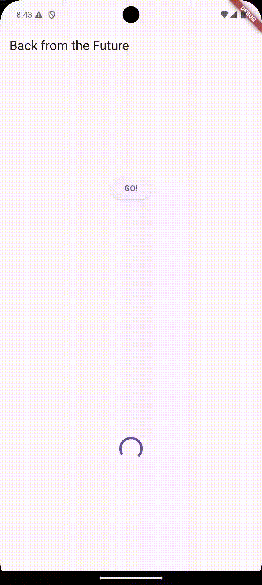

# **JOBSHEET 11 Pemrograman Asynchronous di Flutter**

## **Praktikum 1: Mengunduh Data dari Web Service (API)**

### **Langkah 1: Buat Project Baru**

Buatlah sebuah project flutter baru dengan nama books di folder src week-12 repository GitHub Anda.


Kemudian Tambahkan dependensi http dengan mengetik perintah berikut di terminal.

`flutter pub add http`


### **Langkah 2: Cek file pubspec.yaml**

Jika berhasil install plugin, pastikan plugin http telah ada di file pubspec ini seperti berikut.


### **Langkah 3: Buka file main.dart**

Ketiklah kode seperti berikut ini.


**Soal 1**

Tambahkan nama panggilan Anda pada title app sebagai identitas hasil pekerjaan Anda.

**Hasil**


```dart
import 'dart:async';
import 'package:flutter/material.dart';
import 'package:http/http.dart';
import 'package:http/http.dart' as http;

void main() {
  runApp(const MyApp());
}

class MyApp extends StatelessWidget {
  const MyApp({super.key});

  @override
  Widget build(BuildContext context) {
    return MaterialApp(
      title: 'Future Demo',
      theme: ThemeData(
        primarySwatch: Colors.blue,
        visualDensity: VisualDensity.adaptivePlatformDensity,
      ),
      home: const FuturePage(),
    );

  }
}

class FuturePage extends StatefulWidget {
  const FuturePage({super.key});

  @override
  State<FuturePage> createState() => _FuturePageState();
}

class _FuturePageState extends State<FuturePage> {
  String result =  '';
  @override
  Widget build(BuildContext context) {
    return Scaffold(
      appBar: AppBar(
        title: const Text('Back from the Future'),
      ),
      body: Center(
        child: Column(children: [
        const Spacer(),
          ElevatedButton(
            child: const Text('GO!'),
            onPressed: () {},
          ),
          const Spacer(),
          Text(result),
          const Spacer(),
          const CircularProgressIndicator(),
          const Spacer(),
        ]),
      ),
    );
  }
}
```

### **Langkah 4: Tambah method getData()**

Tambahkan method ini ke dalam **class \_FuturePageState** yang berguna untuk mengambil data dari API Google Books.


```dart
Future<Response> getData() async {
    const authority = 'www.googleapis.com';
    const path = '/books/v1/volumes/NOd3DwAAQBAJ';
    Uri url = Uri.https(authority, path);
    return http.get(url);
  }
```

**Soal 2**

Carilah judul buku favorit Anda di Google Books, lalu ganti ID buku pada variabel path di kode tersebut. Caranya ambil di URL browser Anda seperti gambar berikut ini.


Kemudian cobalah akses di browser URI tersebut dengan lengkap seperti ini. Jika menampilkan data JSON, maka Anda telah berhasil. Lakukan capture milik Anda dan tulis di README pada laporan praktikum. Lalu lakukan commit dengan pesan "W12: Soal 2".

**Hasil**


### **Langkah 5: Tambah kode di ElevatedButton**

Tambahkan kode pada onPressed di ElevatedButton seperti berikut.

```dart
class _FuturePageState extends State<FuturePage> {
  String result =  '';
  @override
  Widget build(BuildContext context) {
    return Scaffold(
      appBar: AppBar(
        title: const Text('Back from the Future'),
      ),
      body: Center(
        child: Column(children: [
        const Spacer(),
          ElevatedButton(
            child: const Text('GO!'),
            onPressed: () {
              setState(() {

                });
                getData().then((value){
                  result = value.body.toString().substring(0,450);
                  setState(() {

                  });
                }).catchError((_){
                  result = 'An error occured';
                  setState(() {});
                });
            },
          ),
          const Spacer(),
          Text(result),
          const Spacer(),
          const CircularProgressIndicator(),
          const Spacer(),
        ]),
      ),
    );
  }
```

**Soal 3**

- Jelaskan maksud kode langkah 5 tersebut terkait substring dan catchError!

**Jawab**

1. substring(0, 450) untuk mengambil 450 karakter pertama dari hasil data value.body, agar hanya sebagian data yang ditampilkan.
2. catchError untuk menangani kesalahan yang terjadi saat memanggil getData(), dan mengatur result menjadi 'An error occurred' agar aplikasi tetap berjalan tanpa crash.

- Capture hasil praktikum Anda berupa GIF dan lampirkan di README. Lalu lakukan commit dengan pesan "W12: Soal 3".

**Hasil**


## **Praktikum 2: Menggunakan await/async untuk menghindari callbacks**

### **Langkah 1: Buka file main.dart**

Tambahkan tiga method berisi kode seperti berikut di dalam **class \_FuturePageState**


```dart
Future<int> returnOneAsync() async {
  await Future.delayed(const Duration(seconds: 3));
  return 1;
}

Future<int> returnTwoAsync() async {
  await Future.delayed(const Duration(seconds: 3));
  return 2;
}

Future<int> returnThreeAsync() async {
  await Future.delayed(const Duration(seconds: 3));
  return 3;
}
```

### **Langkah 2: Tambah method count()**

Lalu tambahkan lagi method ini di bawah ketiga method sebelumnya.

```dart
 Future count() async {
        int total = 0;
        total = await returnOneAsync();
        total += await returnTwoAsync();
        total += await returnThreeAsync();
        setState(() {
          result = total.toString();
        });
      }
```

### **Langkah 3: Panggil count()**

Lakukan comment kode sebelumnya, ubah isi kode onPressed() menjadi seperti berikut.


### **Langkah 4: Run**

Akhirnya, run atau tekan F5 jika aplikasi belum running. Maka Anda akan melihat seperti gambar berikut, hasil angka 6 akan tampil setelah delay 9 detik.

**Hasil**


**Soal 4**

Jelaskan maksud kode langkah 1 dan 2 tersebut!

**Jawab:**

- Kode langkah 1: Terdapat 3 fungsi asynchronous (returnOneAsync, returnTwoAsync, returnThreeAsync) masing-masing menunggu 3 detik sebelum mengembalikan angka 1, 2, dan 3.
- Kode langkah 2: Untuk fungsi count menjalankan ketiga fungsi di atas secara berurutan, menambahkan hasilnya ke total. Setelah semua selesai, hasilnya (total = 6) ditampilkan pada UI melalui setState().

## **Praktikum 3: Menggunakan Completer di Future**

### **Langkah 1: Buka main.dart**

Pastikan telah impor package async berikut.

`import 'package:async/async.dart';`

### **Langkah 2: Tambahkan variabel dan method**

Tambahkan variabel late dan method di **class \_FuturePageState** seperti ini.


```dart
late Completer completer;
Future getNumber() {
  completer = Completer<int>();
  calculate();
  return completer.future;
}

Future calculate() async {
  await Future.delayed(const Duration(seconds : 5));
  completer.complete(42);
}
```

### **Langkah 3: Ganti isi kode onPressed()**

Tambahkan kode berikut pada fungsi onPressed(). Kode sebelumnya bisa Anda comment.


```dart
getNumber().then((value) {
                setState(() {
                  result = value.toString();
                });
              });
```

### **Langkah 4: Run**

Terakhir, run atau tekan F5 untuk melihat hasilnya jika memang belum running. Bisa juga lakukan hot restart jika aplikasi sudah running. Maka hasilnya akan seperti gambar berikut ini. Setelah 5 detik, maka angka 42 akan tampil.

**Hasil**


**Soal 5**

Jelaskan maksud kode langkah 2 tersebut!

**Jawab:**

Kode Program menggunakan Completer untuk mengontrol kapan Future selesai:

- getNumber(): Membuat Future yang belum selesai dan menjalankan calculate() untuk mengisi hasilnya.
- calculate(): Menunggu 5 detik, lalu melengkapi Future dengan nilai 42. Setelah 5 detik, getNumber() akan menghasilkan nilai 42.

### **Langkah 5: Ganti method calculate()**

Gantilah isi code method calculate() seperti kode berikut, atau Anda dapat membuat calculate2()


### **Langkah 6: Pindah ke onPressed()**

Ganti menjadi kode seperti berikut.


```dart
getNumber().then((value) {
  setState(() {
    result = value.toString();
  });
}).catchError((e) {
  result = 'An error occurred';
});
```

**Hasil**



**Soal 6**

Jelaskan maksud perbedaan kode langkah 2 dengan langkah 5-6 tersebut!

**Jawab:**

- Langkah 2: Kode langkah 2 tidak menangani kesalahan, hanya menunggu 5 detik dan mengembalikan 42.
- Langkah 5: berfungsi untuk memperbarui calculate() dengan cara menangani error pakai try-catch. jika proses berhasil, completer.complete(42) akan dipanggil setelah 5 detik. Tapi kalau ada masalah, completer.completeError({}) yang dipakai untuk menandai ada kesalahan.
- Langkah 6: fungsi 'getNumber().then' untuk memproses hasil jika berhasil dan '(result = value.toString())', atau '.catchError(...)' untuk menampilkan pesan 'An error occurred' jika terjadi kesalahan.

**Kode Lengkap**

```dart
import 'dart:async';
import 'package:async/async.dart';
import 'package:flutter/material.dart';
import 'package:http/http.dart';
import 'package:http/http.dart' as http;

void main() {
  runApp(const MyApp());
}

class MyApp extends StatelessWidget {
  const MyApp({super.key});

  @override
  Widget build(BuildContext context) {
    return MaterialApp(
      title: 'Nurul Mustofa',
      theme: ThemeData(
        primarySwatch: Colors.blue,
        visualDensity: VisualDensity.adaptivePlatformDensity,
      ),
      home: const FuturePage(),
    );

  }
}

class FuturePage extends StatefulWidget {
  const FuturePage({super.key});

  @override
  State<FuturePage> createState() => _FuturePageState();
}

class _FuturePageState extends State<FuturePage> {

  late Completer completer;

  Future getNumber() {
    completer = Completer<int>();
    calculate();
    return completer.future;
  }

  Future calculate() async {
    try {
      await Future.delayed(const Duration(seconds : 5));
      completer.complete(42);
    }
    catch(_) {
      completer.completeError({});
    }
  }

  String result =  '';
  @override
  Widget build(BuildContext context) {
    return Scaffold(
      appBar: AppBar(
        title: const Text('Back from the Future'),
      ),
      body: Center(
        child: Column(children: [
        const Spacer(),
          ElevatedButton(
            child: const Text('GO!'),
            onPressed: () {
              getNumber().then((value) {
              setState(() {
                result = value.toString();
              });
            }).catchError((e) {
              result = 'An error occurred';
            });
              // count();
              // setState(() {

              //   });
              //   getData().then((value){
              //     result = value.body.toString().substring(0,450);
              //     setState(() {

              //     });
              //   }).catchError((_){
              //     result = 'An error occured';
              //     setState(() {});
              //   });
            },
          ),
          const Spacer(),
          Text(result),
          const Spacer(),
          const CircularProgressIndicator(),
          const Spacer(),
        ]),
      ),
    );
  }

  Future<Response> getData() async {
      const authority = 'www.googleapis.com';
      const path = '/books/v1/volumes/NOd3DwAAQBAJ';
      Uri url = Uri.https(authority, path);
      return http.get(url);
    }

  Future<int> returnOneAsync() async {
      await Future.delayed(const Duration(seconds: 3));
      return 1;
    }

  Future<int> returnTwoAsync() async {
      await Future.delayed(const Duration(seconds: 3));
      return 2;
    }

  Future<int> returnThreeAsync() async {
      await Future.delayed(const Duration(seconds: 3));
      return 3;
    }

    Future count() async {
        int total = 0;
        total = await returnOneAsync();
        total += await returnTwoAsync();
        total += await returnThreeAsync();
        setState(() {
          result = total.toString();
        });
      }
}
```

## **Praktikum 4: Memanggil Future secara paralel**

### **Langkah 1: Buka file main.dart**

Tambahkan method ini ke dalam **class \_FuturePageState**


```dart
void returnFG() {
      FutureGroup<int> futureGroup = FutureGroup<int>();
      futureGroup.add(returnOneAsync());
      futureGroup.add(returnTwoAsync());
      futureGroup.add(returnThreeAsync());
      futureGroup.close();
      futureGroup.future.then((List <int> value) {
        int total = 0;
        for (var element in value) {
          total += element;
        }
        setState(() {
        result = total.toString();
        });
      });
    }
```

### **Langkah 2: Edit onPressed()**

Anda bisa hapus atau comment kode sebelumnya, kemudian panggil method dari langkah 1 tersebut.


### **Langkah 3: Run**

Anda akan melihat hasilnya dalam 3 detik berupa angka 6 lebih cepat dibandingkan praktikum sebelumnya menunggu sampai 9 detik.

**Hasil**


### **Langkah 4: Ganti variabel futureGroup**

Anda dapat menggunakan FutureGroup dengan Future.wait seperti kode berikut.

```dart
    void returnFG() {
      final futures = Future.wait<int>([
        returnOneAsync(),
        returnTwoAsync(),
        returnThreeAsync(),
      ]).then((List <int> value) {
        int total = 0;
        for (var element in value) {
          total += element;
        }
        setState(() {
        result = total.toString();
        });
      });
    }
```

**Hasil Soal 7**


**Soal 8**

Jelaskan maksud perbedaan kode langkah 1 dan 4!

**Jawab:**

Pada Langkah 1, kita menggunakan FutureGroup, yaitu sebuah paket yang memungkinkan kita untuk menambahkan beberapa Future dan memantau statusnya. Di dalam FutureGroup, setiap Future ditambahkan satu per satu menggunakan futureGroup.add() dan kemudian ditutup dengan futureGroup.close(). Hasil dari semua Future akan dikembalikan setelah semuanya selesai, dan kita dapat memproses hasilnya di dalam then(). FutureGroup mempermudah dalam melacak beberapa Future yang akan diselesaikan secara bersamaan.

Pada Langkah 4, kita menggunakan Future.wait, sebuah fungsi bawaan dari Flutter yang menunggu seluruh Future selesai secara paralel dan mengembalikan hasil dalam bentuk List. Tidak perlu menambahkan Future satu per satu seperti di FutureGroup. Future.wait lebih sederhana dan efisien karena langsung menerima semua Future dalam bentuk list dan mengelola semuanya tanpa perlu melakukan proses add() dan close().

Perbedaan utamanya:

- FutureGroup memiliki mekanisme pengelolaan sendiri untuk menambahkan dan mengelola Future secara individual, sehingga cocok jika kita ingin menambahkan Future secara dinamis.
- Future.wait lebih ringkas dan langsung mengeksekusi semua Future yang diberikan dalam satu list tanpa pengelolaan tambahan, sehingga lebih efisien untuk skenario sederhana.

## **Praktikum 5: Menangani Respon Error pada Async Code**

### **Langkah 1: Buka file main.dart**

Tambahkan method ini ke dalam **class \_FuturePageState**


```dart
Future returnError() async {
    await Future.delayed(const Duration(seconds: 2));
    throw Exception('Something terrible happened!');
  }

```

### **Langkah 2: ElevatedButton**

Ganti dengan kode berikut


```dart
returnError()
    .then ((value){
        setState(() {
            result = 'Success';
        });
    }).catchError((onError){
        setState(() {
            result = onError.toString();
        });
    }).whenComplete(()=>print('Complete'));
```

### **Langkah 3: Run**

Lakukan run dan klik tombol GO! maka akan menghasilkan seperti gambar berikut.

**Hasil Soal 9**


Pada bagian debug console akan melihat teks **Complete** seperti berikut.


### **Langkah 4: Tambah method handleError()**

Tambahkan kode ini di dalam class \_FutureStatePage


```dart
  Future handleError() async {
      try {
        await returnError();
      }
    catch (error) {
      setState(() {
        result = error.toString();
      });
    }
    finally {
      print('Complete');
    }
  }
```

**Soal 10**

Panggil method handleError() tersebut di ElevatedButton, lalu run. Apa hasilnya? Jelaskan perbedaan kode langkah 1 dan 4!


**Hasil Run**


**Debug Console**


**Penjelasan**

**Perbedaan Kode Langkah 1 dan Langkah 4**

Langkah 1: Menggunakan then(), catchError, dan whenComplete.

- Memanfaatkan callback then() untuk menangani success dan catchError untuk menangani error.
- whenComplete akan dijalankan setelah proses selesai, baik itu sukses maupun gagal.
- Kode ini lebih pendek namun mungkin sulit dibaca ketika ada banyak nested callbacks.

Langkah 4: Menggunakan try-catch-finally dengan async/await.

- Lebih sederhana dan rapi karena menggunakan try-catch untuk menangani error.
- finally berfungsi mirip dengan whenComplete dalam then(), tetapi lebih terstruktur dalam pola async/await.
- Cocok untuk kode asynchronous yang lebih kompleks, karena async/await lebih mudah dibaca dan dipahami.

## **Praktikum 6: Menggunakan Future dengan StatefulWidget**

### **Langkah 1: install plugin geolocator**

Tambahkan plugin geolocator dengan mengetik perintah berikut di terminal.

`flutter pub add geolocator`

### **Langkah 2: Tambah permission GPS**

Jika Anda menargetkan untuk platform Android, maka tambahkan baris kode berikut di file android/app/src/main/androidmanifest.xml

```dart
<uses-permission android:name="android.permission.ACCESS_FINE_LOCATION"/>
<uses-permission android:name="android.permission.ACCESS_COARSE_LOCATION"/>
```

Jika Anda menargetkan untuk platform iOS, maka tambahkan kode ini ke file Info.plist

```dart
<key>NSLocationWhenInUseUsageDescription</key>
<string>This app needs to access your location</string>

```

### **Langkah 3: Buat file geolocation.dart**

Tambahkan file baru ini di folder lib project Anda.

### **Langkah 4: Buat StatefulWidget**

Buat class LocationScreen di dalam file geolocation.dart

### **Langkah 5: Isi kode geolocation.dart**

```dart
import 'package:flutter/material.dart';
import 'package:geolocator/geolocator.dart';

class LocationScreen extends StatefulWidget {
  const LocationScreen({super.key});

  @override
  State<LocationScreen> createState() => _LocationScreenState();
}

class _LocationScreenState extends State<LocationScreen> {
  String myPosition = '';
  @override
  void initState() {
    super.initState();
    getPosition().then((Position myPos) {
      myPosition =
          'Latitude: ${myPos.latitude.toString()} - Longitude: {myPos.longitude.toString()}';
      setState(() {
        myPosition = myPosition;
    });
  });

}

  @override
  Widget build(BuildContext context) {
    return Scaffold(
      appBar: AppBar(title: const Text('Current Location')),
      body: Center(child: Text(myPosition)),
    );
  }
  Future<Position> getPosition() async {
    await Geolocator.requestPermission();
    await Geolocator.isLocationServiceEnabled();
    Position? position = await Geolocator.getCurrentPosition();
    return position;
  }
}
```

**Soal 11**

- Tambahkan nama panggilan Anda pada tiap properti title sebagai identitas pekerjaan Anda.


### **Langkah 6: Edit main.dart**

Panggil screen baru tersebut di file main Anda seperti berikut.

`home: LocationScreen(),`

### **Langkah 7: Run**

Run project Anda di device atau emulator (bukan browser), maka akan tampil seperti berikut ini.


### **Langkah 8: Tambahkan animasi loading**

Tambahkan widget loading seperti kode berikut. Lalu hot restart, perhatikan perubahannya.

```dart
  @override
  Widget build(BuildContext context) {
    final myWidget = myPosition == ''
    ? const CircularProgressIndicator()
    : Text(myPosition);

      return Scaffold(
      appBar: AppBar(title: const Text('Current Location-Nurul Mustofa')),
      body: Center(child:myWidget),
    );
  }
```

**Soal 12**

- Jika Anda tidak melihat animasi loading tampil, kemungkinan itu berjalan sangat cepat. Tambahkan delay pada method getPosition() dengan kode await Future.delayed(const Duration(seconds: 3));

```dart
Future<Position> getPosition() async {
    await Geolocator.requestPermission();
    await Geolocator.isLocationServiceEnabled();
    await Future.delayed(const Duration(seconds: 3));
    Position? position = await Geolocator.getCurrentPosition();
    return position;
  }
```

- Apakah Anda mendapatkan koordinat GPS ketika run di browser? Mengapa demikian?

  **Jawab:**

  Tidak, GPS tidak akan bekerja di browser karena browser tidak memiliki izin untuk mengakses layanan GPS perangkat secara langsung seperti halnya pada device fisik atau emulator mobile.

- Capture hasil praktikum Anda berupa GIF dan lampirkan di README. Lalu lakukan commit dengan pesan "W12: Soal 12".
  **Hasil**


### **Praktikum 7: Manajemen Future dengan FutureBuilder**

### **Langkah 1: Modifikasi method getPosition()**

Buka file geolocation.dart kemudian ganti isi method dengan kode ini.

```dart
  Future<Position> getPosition() async {
    await Geolocator.isLocationServiceEnabled();
    await Future.delayed(const Duration(seconds: 3));
    Position position = await Geolocator.getCurrentPosition();
    return position;
  }
```

### **Langkah 2: Tambah variabel**

Tambah variabel ini di class \_LocationScreenState


`Future<Position>? position;`

### **Langkah 3: Tambah initState()**

Tambah method ini dan set variabel position

```dart
  @override
  void initState() {
    super.initState();
    position = getPosition();
}
```

### **Langkah 4: Edit method build()**

Ketik kode berikut dan sesuaikan. Kode lama bisa Anda comment atau hapus.

```dart
@override
Widget build(BuildContext context) {
  return Scaffold(
    appBar: AppBar(title: const Text('Current Location - Nurul Mustofa')),
    body: Center(
      child: FutureBuilder<Position>(
        future: position,
        builder: (BuildContext, AsyncSnapshot<Position> snapshot) {
          if (snapshot.connectionState == ConnectionState.waiting) {
            return const CircularProgressIndicator();
          } else if (snapshot.connectionState == ConnectionState.done) {
            return Text(
              snapshot.data.toString()
            );
          }
          else {
            return const Text('');
          }
        },
      ),
    ),
  );
}
```

**Soal 13**

- Apakah ada perbedaan UI dengan praktikum sebelumnya? Mengapa demikian?
  **Jawab**

Perbedaan UI dengan praktikum sebelumnya adalah bahwa FutureBuilder menyediakan tampilan yang lebih efisien, rapi, dan reaktif. Hal ini karena FutureBuilder secara otomatis memperbarui UI berdasarkan status Future, seperti waiting atau done, tanpa perlu setState secara manual.

- Capture hasil praktikum Anda berupa GIF dan lampirkan di README. Lalu lakukan commit dengan pesan "W12: Soal 13".
  **Hasil**


- Seperti yang Anda lihat, menggunakan FutureBuilder lebih efisien, clean, dan reactive dengan Future bersama UI.

### **Langkah 5: Tambah handling error**

Tambahkan kode berikut untuk menangani ketika terjadi error. Kemudian hot restart.

```dart
else if (snapshot.connectionState == ConnectionState.done) {
  if (snapshot.hasError) {
     return Text('Something terrible happened!');
  }
  return Text(snapshot.data.toString());
}
```

```dart
@override
Widget build(BuildContext context) {
  return Scaffold(
    appBar: AppBar(title: const Text('Current Location - Nurul Mustofa')),
    body: Center(
      child: FutureBuilder<Position>(
        future: position,
        builder: (BuildContext, AsyncSnapshot<Position> snapshot) {
          if (snapshot.connectionState == ConnectionState.waiting) {
            return const CircularProgressIndicator();
          } else if (snapshot.connectionState == ConnectionState.done) {
            return Text(
              snapshot.data.toString()
            );
          } else if (snapshot.connectionState == ConnectionState.done) {
            if (snapshot.hasError) {
              return const Text('Something terrible happened!');
            }
            return Text(snapshot.data.toString());
          }
          else {
            return const Text('');
          }
        },
      ),
    ),
  );
}
```

**Soal 14**

- Apakah ada perbedaan UI dengan langkah sebelumnya? Mengapa demikian?
  **Jawab:**

Pada langkah ini, jika terjadi error, FutureBuilder menampilkan pesan error secara otomatis. UI sekarang memiliki kemampuan untuk menampilkan pesan "Something terrible happened!" jika ada masalah pada proses pengambilan data lokasi, membuat aplikasi lebih informatif dan ramah pengguna.

- Capture hasil praktikum Anda berupa GIF dan lampirkan di README. Lalu lakukan commit dengan pesan "W12: Soal 14".


### **Praktikum 8: Navigation route dengan Future Function**

### **Langkah 1: Buat file baru navigation_first.dart**

Buatlah file baru ini di project lib Anda.

### **Langkah 2: Isi kode navigation_first.dart**

`import 'package:flutter/material.dart';`

**Soal 15**

- Tambahkan nama panggilan Anda pada tiap properti title sebagai identitas pekerjaan Anda.
- Silakan ganti dengan warna tema favorit Anda.

### **Langkah 3: Tambah method di class \_NavigationFirstState**

Tambahkan method ini.

```dart
Future _navigateAndGetColor(BuildContext context) async {
   color = await Navigator.push(context,
        MaterialPageRoute(builder: (context) => const NavigationSecond()),) ?? Colors.blue;
   setState(() {});
   });
}
```

### **Langkah 4: Buat file baru navigation_second.dart**

Buat file baru ini di project lib Anda. Silakan jika ingin mengelompokkan view menjadi satu folder dan sesuaikan impor yang dibutuhkan.

### **Langkah 5: Buat class NavigationSecond dengan StatefulWidget**

```dart
import 'package:flutter/material.dart';

class NavigationSecond extends StatefulWidget {
  const NavigationSecond({super.key});

  @override
  State<NavigationSecond> createState() => _NavigationSecondState();
}

class _NavigationSecondState extends State<NavigationSecond> {
  @override
  Widget build(BuildContext context) {
    Color color;
    return Scaffold(
      appBar: AppBar(
        title: const Text('Navigation Second - Nurul Mustofa'),
      ),
      body: Center(
        child: Column(
          mainAxisAlignment: MainAxisAlignment.spaceEvenly,
          children: [
            ElevatedButton(
              child: const Text('Red'),
              onPressed: () {
                color = Colors.red.shade700;
                Navigator.pop(context, color);
              },
            ),
            ElevatedButton(
              child: const Text('Green'),
              onPressed: () {
                color = Colors.green.shade700;
                Navigator.pop(context, color);
              },
            ),
            ElevatedButton(
              child: const Text('Blue'),
              onPressed: () {
                color = Colors.blue.shade700;
                Navigator.pop(context, color);
              },
            ),
          ],
        ),
      ),
    );
  }
}
```

### **Langkah 6: Edit main.dart**

Lakukan edit properti home.

`home: const NavigationFirst(),`

### **Langkah 7: Run**

Lakukan run, jika terjadi error silakan diperbaiki.

**Hasil**


**Soal 16**

- Cobalah klik setiap button, apa yang terjadi ? Mengapa demikian ?
  **Jawab:**

Perubahan UI: UI sekarang lebih interaktif dengan tombol yang memungkinkan pengguna memilih warna dari halaman kedua, dan halaman pertama berubah warnanya sesuai dengan pilihan dari halaman kedua.
Apa yang Terjadi Saat Tombol Diklik: Ketika tombol diklik, halaman kedua muncul. Setelah memilih warna, halaman pertama akan memperbarui warna berdasarkan pilihan dari halaman kedua.

- Gantilah 3 warna pada langkah 5 dengan warna favorit Anda!

```dart
      body: Center(
        child: Column(
          mainAxisAlignment: MainAxisAlignment.spaceEvenly,
          children: [
            ElevatedButton(
              child: const Text('Yellow'),
              onPressed: () {
                color = Colors.yellow.shade500;
                Navigator.pop(context, color);
              },
            ),
            ElevatedButton(
              child: const Text('Violet'),
              onPressed: () {
                color = const Color.fromARGB(255, 95, 56, 142);
                Navigator.pop(context, color);
              },
            ),
            ElevatedButton(
              child: const Text('Orange'),
              onPressed: () {
                color = Colors.orange.shade500;
                Navigator.pop(context, color);
              },
            ),
          ],
        ),
      ),
```

**Hasil**


### **Langkah 1: Buat file baru navigation_dialog.dart**

Buat file dart baru di folder lib project Anda.

### **Langkah 2: Isi kode navigation_dialog.dart**

```dart
import 'package:flutter/material.dart';

class NavigationDialogScreen extends StatefulWidget {
  const NavigationDialogScreen({super.key});

  @override
  State<NavigationDialogScreen> createState() => _NavigationDialogScreenState();
}

class _NavigationDialogScreenState extends State<NavigationDialogScreen> {
  Color color = Colors.blue.shade700;

  @override
  Widget build(BuildContext context) {
    return Scaffold(
      backgroundColor: color,
      appBar: AppBar(
        title: const Text('Navigation Dialog Screen'),
      ),
      body: Center(
        child: ElevatedButton(
          child: const Text('Change Color'),
          onPressed: () {
          },
        ),
      ),
    );
  }
}
```

### **Langkah 3: Tambah method async**

```dart
  _showColorDialog(BuildContext context) async {
  await showDialog(
    barrierDismissible: false,
    context: context,
    builder: (_) {
      return AlertDialog(
        title: const Text('Very important question'),
        content: const Text('Please choose a color'),
        actions: <Widget>[
          TextButton(
            child: const Text('Red'),
            onPressed: () {
              Navigator.pop(context, Colors.red.shade700);
            },
          ),
          TextButton(
            child: const Text('Green'),
            onPressed: () {
              Navigator.pop(context, Colors.green.shade700);
            },
          ),
          TextButton(
            child: const Text('Blue'),
            onPressed: () {
              Navigator.pop(context, Colors.blue.shade700);
            },
          ),
        ],
      );
    },
  );
    setState(() {});
  }
```

### **Langkah 4: Panggil method di ElevatedButton**

```dart
child: ElevatedButton(
          child: const Text('Change Color'),
          onPressed: () {
             _showColorDialog(context);
          },
        ),
```

### **Langkah 5: Edit main.dart**

Ubah properti home

`home: const NavigationDialogScreen(),`

### **Langkah 6: Run**

Coba ganti warna background dengan widget dialog tersebut. Jika terjadi error, silakan diperbaiki. Jika berhasil, akan tampil seperti gambar berikut.


```dart
import 'package:flutter/material.dart';

class NavigationDialogScreen extends StatefulWidget {
  const NavigationDialogScreen({super.key});

  @override
  State<NavigationDialogScreen> createState() => _NavigationDialogScreenState();
}

class _NavigationDialogScreenState extends State<NavigationDialogScreen> {
  Color color = Colors.blue.shade700;

  @override
  Widget build(BuildContext context) {
    return Scaffold(
      backgroundColor: color,
      appBar: AppBar(
        title: const Text('Navigation Dialog Screen'),
      ),
      body: Center(
        child: ElevatedButton(
          child: const Text('Change Color'),
          onPressed: () {
            _showColorDialog(context);
          },
        ),
      ),
    );
  }

  // Method untuk menampilkan dialog dan menangkap warna yang dipilih
  _showColorDialog(BuildContext context) async {
    // Menampilkan dialog dan menunggu hasilnya (warna yang dipilih)
    Color? selectedColor = await showDialog(
      barrierDismissible: false,
      context: context,
      builder: (_) {
        return AlertDialog(
          title: const Text('Very important question'),
          content: const Text('Please choose a color'),
          actions: <Widget>[
            TextButton(
              child: const Text('Red'),
              onPressed: () {
                Navigator.pop(context, Colors.red.shade700);
              },
            ),
            TextButton(
              child: const Text('Green'),
              onPressed: () {
                Navigator.pop(context, Colors.green.shade700);
              },
            ),
            TextButton(
              child: const Text('Blue'),
              onPressed: () {
                Navigator.pop(context, Colors.blue.shade700);
              },
            ),
          ],
        );
      },
    );

    // Jika ada warna yang dipilih, ubah warna latar belakang
    if (selectedColor != null) {
      setState(() {
        color = selectedColor; // Perbarui warna latar belakang
      });
    }
  }
}
```

**Soal 17**

- Cobalah klik setiap button, apa yang terjadi ? Mengapa demikian ?
  **Jawab:**
- Setiap tombol dalam dialog memanggil Navigator.pop(context, Colors.[color]) yang mengembalikan warna yang dipilih ke halaman pertama.
- Setelah pengguna memilih warna, setState dipanggil untuk memperbarui UI dengan warna baru yang diterima dari dialog.

- Gantilah 3 warna pada langkah 3 dengan warna favorit Anda!

```dart
return AlertDialog(
          title: const Text('Very important question'),
          content: const Text('Please choose a color'),
          actions: <Widget>[
            TextButton(
              child: const Text('Yellow'),
              onPressed: () {
                Navigator.pop(context, Colors.yellow.shade500);
              },
            ),
            TextButton(
              child: const Text('Pink'),
              onPressed: () {

                Navigator.pop(context, Colors.pink.shade500);
              },
            ),
            TextButton(
              child: const Text('Orange'),
              onPressed: () {
                Navigator.pop(context, Colors.orange.shade500);
              },
            ),
          ],
        );
```

**Hasil**


