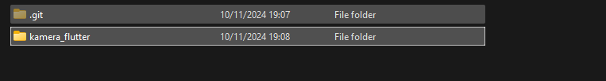

### Nama : Muhammad Nurul Mustofa

### Kelas : TI 3A

### NIm : 2241720022

# 3. Praktikum 1: Mengambil Foto dengan Kamera di Flutter

Selesaikan langkah-langkah praktikum berikut ini menggunakan editor Visual Studio Code (VS Code) atau Android Studio atau code editor lain kesukaan Anda.

`Perhatian: Diasumsikan Anda telah berhasil melakukan setup environment Flutter SDK, VS Code, Flutter Plugin, dan Android SDK pada pertemuan pertama.`

## Langkah 1: Buat Project Baru

Buatlah sebuah project flutter baru dengan nama kamera_flutter, lalu sesuaikan style laporan praktikum yang Anda buat.



## Langkah 2: Tambah dependensi yang diperlukan

Anda memerlukan tiga dependensi pada project flutter untuk menyelesaikan praktikum ini.

`camera` → menyediakan seperangkat alat untuk bekerja dengan kamera pada device.

`path_provider` → menyediakan lokasi atau path untuk menyimpan hasil foto.

`path` → membuat path untuk mendukung berbagai platform.

Untuk menambahkan dependensi plugin, jalankan perintah `flutter pub add` seperti berikut di terminal:

```dart
flutter pub add camera path_provider path
```


`Tips`

`Untuk Android, Anda harus update variabel minSdkVersion = 21 (atau lebih tinggi) pada file gradle.
Pada iOS, baris kode berikut harus ditambahkan pada file ios/Runner/Info.plist untuk mengakses kamera dan microphone.`

```dart
<key>NSCameraUsageDescription</key>
<string>Explanation on why the camera access is needed.</string>
<key>NSMicrophoneUsageDescription</key>
<string>Explanation on why the microphone access is needed.</string>
```

## Langkah 3: Ambil Sensor Kamera dari device

Selanjutnya, kita perlu mengecek jumlah kamera yang tersedia pada perangkat menggunakan plugin camera seperti pada kode berikut ini. Kode ini letakkan dalam `void main()`.

**lib/main.dart**

```dart
// Ensure that plugin services are initialized so that `availableCameras()`
// can be called before `runApp()`
WidgetsFlutterBinding.ensureInitialized();

// Obtain a list of the available cameras on the device.
final cameras = await availableCameras();

// Get a specific camera from the list of available cameras.
final firstCamera = cameras.first;
```

Ubah void main() menjadi async function seperti berikut ini.

**lib/main.dart**

```dart
Future<void> main() async {
  ...
}
```

Pastikan melakukan impor plugin sesuai yang dibutuhkan.

**Kode Lengkap**

```dart
import 'package:flutter/material.dart';
import 'package:camera/camera.dart';
import 'widget/takepicture_screen.dart';

Future<void> main() async {
  // Initialize the camera plugin
  WidgetsFlutterBinding.ensureInitialized();
  final cameras = await availableCameras();
  final firstCamera = cameras.first;
}

```

#### Langkah 4: Buat dan inisialisasi CameraController

Setelah Anda dapat mengakses kamera, gunakan langkah-langkah berikut untuk membuat dan menginisialisasi CameraController. Pada langkah berikut ini, Anda akan membuat koneksi ke kamera perangkat yang memungkinkan Anda untuk mengontrol kamera dan menampilkan pratinjau umpan kamera.

1. Buat StatefulWidget dengan kelas State pendamping.
2. Tambahkan variabel ke kelas State untuk menyimpan CameraController.
3. Tambahkan variabel ke kelas State untuk menyimpan Future yang dikembalikan dari CameraController.initialize().
4. Buat dan inisialisasi controller dalam metode initState().
5. Hapus controller dalam metode dispose().

**lib/widget/takepicture_screen.dart**

```dart
// A screen that allows users to take a picture using a given camera.
class TakePictureScreen extends StatefulWidget {
  const TakePictureScreen({
    super.key,
    required this.camera,
  });

  final CameraDescription camera;

  @override
  TakePictureScreenState createState() => TakePictureScreenState();
}

class TakePictureScreenState extends State<TakePictureScreen> {
  late CameraController _controller;
  late Future<void> _initializeControllerFuture;

  @override
  void initState() {
    super.initState();
    // To display the current output from the Camera,
    // create a CameraController.
    _controller = CameraController(
      // Get a specific camera from the list of available cameras.
      widget.camera,
      // Define the resolution to use.
      ResolutionPreset.medium,
    );

    // Next, initialize the controller. This returns a Future.
    _initializeControllerFuture = _controller.initialize();
  }

  @override
  void dispose() {
    // Dispose of the controller when the widget is disposed.
    _controller.dispose();
    super.dispose();
  }

  @override
  Widget build(BuildContext context) {
    // Fill this out in the next steps.
    return Container();
  }
}

```

> **Perhatian:** Jika Anda tidak menginisialisasi CameraController, Anda tidak dapat menggunakan kamera untuk menampilkan pratinjau dan mengambil gambar.

#### Langkah 5 - Gunakan CameraPreview untuk menampilkan preview foto

Gunakan widget CameraPreview dari package camera untuk menampilkan preview foto. Anda perlu tipe objek void berupa FutureBuilder untuk menangani proses async.

> **Perhatian:** Pada kode ini Anda perlu logic untuk menunggu controller selesai proses inisialisasi sebelum bekerja dengan kamera. Anda harus menunggu hasil dari method \_initializeControllerFuture(), yang telah dibuat sebelumnya, agar dapat menampilkan preview foto dengan CameraPreview.

**lib/widget/takepicture_screen.dart**

```dart
@override
  Widget build(BuildContext context) {
    return Scaffold(
      appBar: AppBar(title: const Text('Take a picture - NIM Anda')),
      // You must wait until the controller is initialized before displaying the
      // camera preview. Use a FutureBuilder to display a loading spinner until the
      // controller has finished initializing.
      body: FutureBuilder<void>(
        future: _initializeControllerFuture,
        builder: (context, snapshot) {
          if (snapshot.connectionState == ConnectionState.done) {
            // If the Future is complete, display the preview.
            return CameraPreview(_controller);
          } else {
            // Otherwise, display a loading indicator.
            return const Center(child: CircularProgressIndicator());
          }
        },
      ),
    )
  }
```

#### Langkah 6: Ambil foto dengan CameraController

Anda dapat menggunakan CameraController untuk mengambil gambar menggunakan metode takePicture(), yang mengembalikan objek XFile, merupakan sebuah objek abstraksi File lintas platform yang disederhanakan. Pada Android dan iOS, gambar baru disimpan dalam direktori cache masing-masing, dan path ke lokasi tersebut dikembalikan dalam XFile.

Pada codelab ini, buatlah sebuah FloatingActionButton yang digunakan untuk mengambil gambar menggunakan CameraController saat pengguna mengetuk tombol.

Pengambilan gambar memerlukan 2 langkah:

1. Pastikan kamera telah diinisialisasi.
2. Gunakan controller untuk mengambil gambar dan pastikan ia mengembalikan objek Future.

Praktik baik untuk membungkus operasi kode ini dalam blok try / catch guna menangani berbagai kesalahan yang mungkin terjadi.

Kode berikut letakkan dalam Widget build setelah field body.

**lib/widget/takepicture_screen.dart**

```dart
FloatingActionButton(
  // Provide an onPressed callback.
  onPressed: () async {
    // Take the Picture in a try / catch block. If anything goes wrong,
    // catch the error.
    try {
      // Ensure that the camera is initialized.
      await _initializeControllerFuture;

      // Attempt to take a picture and then get the location
      // where the image file is saved.
      final image = await _controller.takePicture();
    } catch (e) {
      // If an error occurs, log the error to the console.
      print(e);
    }
  },
  child: const Icon(Icons.camera_alt),
)
```

#### Langkah 7: Buat widget baru DisplayPictureScreen

Buatlah file baru pada folder widget yang berisi kode berikut.

**lib/widget/displaypicture_screen.dart**

```dart
// A widget that displays the picture taken by the user.
class DisplayPictureScreen extends StatelessWidget {
  final String imagePath;

  const DisplayPictureScreen({super.key, required this.imagePath});

  @override
  Widget build(BuildContext context) {
    return Scaffold(
      appBar: AppBar(title: const Text('Display the Picture - NIM Anda')),
      // The image is stored as a file on the device. Use the `Image.file`
      // constructor with the given path to display the image.
      body: Image.file(File(imagePath)),
    );
  }
}
```

#### Langkah 8: Edit main.dart

Edit pada file ini bagian runApp seperti kode berikut.

**lib/main.dart**

```dart
runApp(
    MaterialApp(
      theme: ThemeData.dark(),
      home: TakePictureScreen(
        // Pass the appropriate camera to the TakePictureScreen widget.
        camera: firstCamera,
      )
      debugShowCheckedModeBanner: false,
    ),
  );

```

#### Langkah 9: Menampilkan hasil foto

Tambahkan kode seperti berikut pada bagian try / catch agar dapat menampilkan hasil foto pada DisplayPictureScreen.

**lib/widget/takepicture_screen.dart**

```dart
// Take the Picture in a try / catch block. If anything goes wrong,
          // catch the error.
          try {
            // Ensure that the camera is initialized.
            await _initializeControllerFuture;

            // Attempt to take a picture and get the file `image`
            // where it was saved.
            final image = await _controller.takePicture();

            if (!context.mounted) return;

            // If the picture was taken, display it on a new screen.
            await Navigator.of(context).push(
              MaterialPageRoute(
                builder: (context) => DisplayPictureScreen(
                  // Pass the automatically generated path to
                  // the DisplayPictureScreen widget.
                  imagePath: image.path,
                ),
              ),
            );
          } catch (e) {
            // If an error occurs, log the error to the console.
            print(e);
          }
```

**Hasil**


**Kode Program**
**lib/main.dart**

```dart
import 'package:flutter/material.dart';
import 'package:camera/camera.dart';
import 'widget/takepicture_screen.dart';

Future<void> main() async {
  // Initialize the camera plugin
  WidgetsFlutterBinding.ensureInitialized();
  final cameras = await availableCameras();
  final firstCamera = cameras.first;

  runApp(
    MaterialApp(
      theme: ThemeData.dark(),
      home: TakePictureScreen(camera: firstCamera),
      debugShowCheckedModeBanner: false,
    ),
  );
}
```

**lib/widget/takepicture_screen.dart**

```dart
import 'package:flutter/material.dart';
import 'package:camera/camera.dart';
import 'displaypicture_screen.dart';

class TakePictureScreen extends StatefulWidget {
  final CameraDescription camera;

  const TakePictureScreen({super.key, required this.camera});

  @override
  TakePictureScreenState createState() => TakePictureScreenState();
}

class TakePictureScreenState extends State<TakePictureScreen> {
  late CameraController _controller;
  late Future<void> _initializeControllerFuture;

  @override
  void initState() {
    super.initState();
    _controller = CameraController(
      widget.camera,
      ResolutionPreset.medium,
    );
    _initializeControllerFuture = _controller.initialize();
  }

  @override
  void dispose() {
    _controller.dispose();
    super.dispose();
  }

  @override
  Widget build(BuildContext context) {
    return Scaffold(
      appBar: AppBar(title: const Text('Take a Picture')),
      body: FutureBuilder<void>(
        future: _initializeControllerFuture,
        builder: (context, snapshot) {
          if (snapshot.connectionState == ConnectionState.done) {
            return CameraPreview(_controller);
          } else {
            return const Center(child: CircularProgressIndicator());
          }
        },
      ),
      floatingActionButton: FloatingActionButton(
        onPressed: () async {
          try {
            await _initializeControllerFuture;
            final image = await _controller.takePicture();

            if (!context.mounted) return;
            await Navigator.of(context).push(
              MaterialPageRoute(
                builder: (context) => DisplayPictureScreen(imagePath: image.path),
              ),
            );
          } catch (e) {
            print(e);
          }
        },
        child: const Icon(Icons.camera_alt),
      ),
    );
  }
}
```

**lib/widget/displaypicture_screen.dart**

```dart
import 'dart:io';
import 'package:flutter/material.dart';

class DisplayPictureScreen extends StatelessWidget {
  final String imagePath;

  const DisplayPictureScreen({super.key, required this.imagePath});

  @override
  Widget build(BuildContext context) {
    return Scaffold(
      appBar: AppBar(title: const Text('Display the Picture')),
      body: Image.file(File(imagePath)),
    );
  }
}
```
